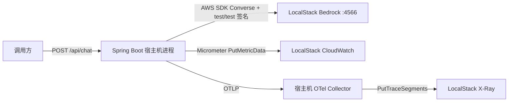
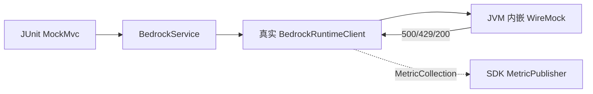
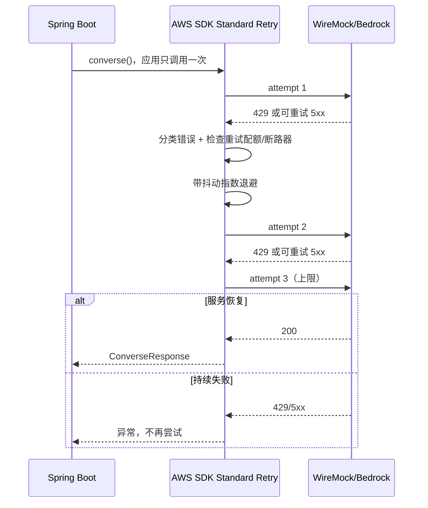
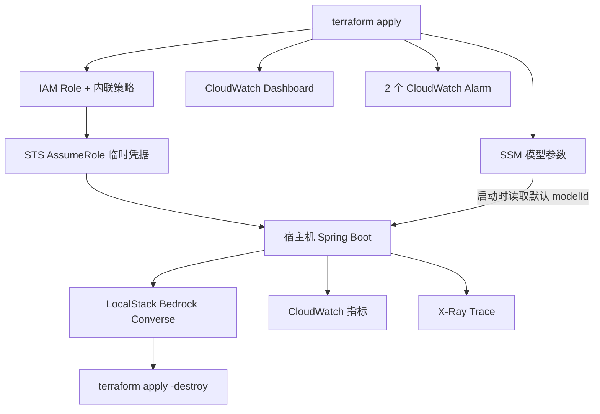

# 架构说明

## 1. LocalStack E2E



LocalStack 由用户独立提供。项目只连接 `localhost:4566`，不会创建、关闭或重配 LocalStack 容器。

## 2. 确定性故障注入



LocalStack 负责真实功能 E2E，但不适合稳定制造“恰好两次 429 后成功”。因此重试教学证据继续使用进程内 WireMock；测试结束后服务器自动关闭，不创建 Docker 容器。

## 3. 应用代码结构

```text
com.example.bedrocklab
├── BedrockResilienceObservabilityApplication.java
├── ChatController.java
├── ApiExceptionHandler.java
├── BedrockConfiguration.java
├── LocalStackConfiguration.java
├── BedrockService.java
└── BedrockTelemetry.java
```

DTO 使用嵌套 record；Bedrock 调用和错误分类集中在一个 Service；SDK MetricPublisher、调用上下文和 Micrometer 指标集中在一个 Telemetry 类。实验只有一个模型后端，因此不增加 Gateway 接口和多组异常子类。

## 4. Standard Retry 时序



## 5. LocalStack 浮点兼容边界

```text
LocalStack Converse HTTP 200
    metrics.latencyMs = 76266.0
        ↓ local-only ExecutionInterceptor
    metrics.latencyMs = 76266
        ↓
AWS Java SDK 正常反序列化
```

拦截器只改目标 JSON 字段的整数浮点形式，不改 token、answer、HTTP status或错误响应。AWS profile不安装此拦截器。

## 6. LocalStack Terraform



Terraform provider 显式覆盖 IAM、STS、SSM、CloudWatch 和 X-Ray endpoint。编排脚本使用 Terraform CLI真正执行 `apply`，并在基础设施存活期间完成应用 E2E；无论应用验证成功还是失败，`finally`清理都会执行 `apply -destroy`。Spring Boot仍是宿主机进程，Bedrock是托管 Runtime，而不是 Terraform创建的计算实例。

当前 LocalStack能创建 X-Ray Sampling Rule，但 AWS provider随即读取标签时会调用 LocalStack尚未实现的 `ListTagsForResource` 并收到 501。因此本实验不保留无法正常 apply/destroy的采样规则；X-Ray运行证据由精确 trace ID查询提供。

## 7. 延迟归因

```text
请求总耗时
 ├─ 应用自身耗时
 ├─ aws.sdk.backoff_delay_ms
 ├─ AWS SDK HTTP/服务调用耗时
 └─ bedrock.model_latency_ms
```

如果模型延迟高而 backoff 为 0，问题更可能在模型；如果 RetryCount 和 backoff 同时升高，则 SDK退避对总延迟有实质贡献。
