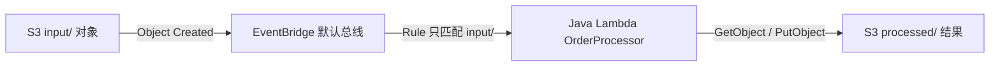

# S3 EventBridge Lambda 学习实验

这是一个极简的 AWS 事件驱动架构学习 Lab：



本项目只使用你本机已经运行的 LocalStack Ultimate：`http://localhost:4566`。项目不会启动 LocalStack，不会创建 Docker 容器，也不会连接真实 AWS。

## 学习目标

- S3 如何把 Object Created 事件发送到 EventBridge。
- EventBridge 默认总线如何用 Event Pattern 做路由和过滤。
- EventBridge 如何通过 Target 调用 Java Lambda。
- Lambda 如何解析真实形状的 S3 EventBridge envelope。
- Lambda 如何从同一个 S3 bucket 读取 `input/`，并写入 `processed/`。
- 为什么 `processed/` 不会再次匹配 `input/`，从而避免递归触发。

## 资源边界

Terraform 严格管理 8 个主要资源：

| AWS 服务 | Terraform resource | 用途 |
|---|---|---|
| S3 | `aws_s3_bucket` | 保存输入和处理结果 |
| S3 | `aws_s3_bucket_notification` | 打开 S3 → EventBridge 通知 |
| IAM | `aws_iam_role` | Lambda 执行身份 |
| IAM | `aws_iam_role_policy` | 允许读写实验对象，并允许 Lambda 写入 CloudWatch Logs |
| Lambda | `aws_lambda_function` | Java 订单处理器 |
| EventBridge | `aws_cloudwatch_event_rule` | 匹配 S3 Object Created 事件 |
| EventBridge | `aws_cloudwatch_event_target` | 把规则事件路由到 Lambda |
| Lambda | `aws_lambda_permission` | 只允许指定 EventBridge Rule 调用 Lambda |

`aws_cloudwatch_event_rule` 和 `aws_cloudwatch_event_target` 是 Terraform AWS Provider 的历史命名，实际对应 Amazon EventBridge。项目不创建自定义 Event Bus，也不创建第二个 bucket。

项目明确不包含 CloudWatch Logs 资源、Alarm、SQS、SNS、DynamoDB、Step Functions、API Gateway、KMS、ECS 或 ECR。Lambda 使用 AWS 默认的 `/aws/lambda/<函数名>` 日志组；本 Lab 不管理日志组生命周期，但 IAM 策略已包含真实 AWS 所需的日志写入权限。

## 目录结构

```text
s3-eventbridge-lambda-lab/
├── README.md
├── Makefile
├── terraform/
│   ├── versions.tf
│   ├── providers.tf
│   ├── variables.tf
│   ├── s3.tf
│   ├── iam.tf
│   ├── lambda.tf
│   ├── eventbridge.tf
│   ├── outputs.tf
│   └── terraform.tfvars.example
├── lambda/
│   ├── pom.xml
│   └── src/main/java/com/example/eventlab/
├── fixtures/
│   ├── order-001.json
│   └── malformed-order.json
├── scripts/
│   ├── build.sh
│   ├── deploy.sh
│   ├── verify.sh
│   ├── verify-local.ps1
│   ├── destroy.sh
│   └── reset.sh
└── docs/
    ├── architecture.md
    ├── validation-report.md
    └── sample-event.json
```

Terraform 文件放在 `terraform/`，便于直接使用 `terraform -chdir=terraform`；其余目录保持 Lambda 学习项目的直观结构。

## 快速开始

前提：LocalStack Ultimate 已由外部环境运行在 `http://localhost:4566`，并且本机已安装 Java 21、Maven、Terraform、AWS CLI 和 PowerShell。

```powershell
Set-Location D:\workshop\aug\cloud-architecture-labs\s3-eventbridge-lambda-lab
& 'D:\Git\bin\bash.exe' scripts/verify.sh
```

`verify.sh` 会完成：

1. 编译 Java Lambda，并运行 JUnit 5。
2. 执行 `terraform fmt -check` 和 `terraform validate`。
3. 用真实 `terraform apply` 部署 8 个资源。
4. 通过 AWS CLI 检查 S3 EventBridge notification、Rule、Target 和 Lambda permission。
5. 上传 `input/order-001.json`，等待 EventBridge 自动触发 Lambda。
6. 验证 `processed/order-001.result.json`。
7. 上传 `ignored/order-ignored.json`，验证不会生成处理结果。
8. 上传格式正确但字段缺失的 malformed payload，验证生成 `.error.json`。
9. 用 `terraform apply -destroy` 清理资源。

E2E 绝不会调用 `aws lambda invoke`。正向路径唯一的触发方式是：

```text
S3 PutObject
  → S3 EventBridge notification
  → EventBridge default bus
  → EventBridge Rule
  → EventBridge Target
  → Java Lambda
  → S3 processed/
```

## 业务示例

输入 `fixtures/order-001.json`：

```json
{
  "orderId": "ORD-001",
  "customerId": "CUS-001",
  "amount": 125.50,
  "currency": "NZD"
}
```

上传到 `input/order-001.json` 后，Lambda 写入 `processed/order-001.result.json`：

```json
{
  "orderId": "ORD-001",
  "sourceKey": "input/order-001.json",
  "status": "PROCESSED",
  "processedAt": "2026-08-30T00:00:00Z",
  "amount": 125.50,
  "currency": "NZD"
}
```

Malformed 输入会写入 `processed/malformed-order.error.json`，不会让 Lambda 因业务校验错误崩溃。生产系统还需要考虑 at-least-once delivery、重复事件和幂等键；本 Lab 只在文档中说明，不额外引入 DynamoDB。

## LocalStack Lambda endpoint

宿主机可以使用 `http://localhost:4566`，但 LocalStack 启动的 Lambda runtime 通常运行在另一个网络命名空间。Terraform 默认把 Lambda 内部访问地址设为 `http://host.docker.internal:4566`，脚本可用 `-LambdaEndpoint` 覆盖。

Java Handler 只在存在 `AWS_ENDPOINT_URL` 时启用 endpoint override；没有该变量时使用 AWS SDK 默认 endpoint resolution，因此业务代码仍可迁移到真实 AWS。LocalStack 的 Lambda runtime 可能由 LocalStack 自己启动隔离执行环境；本项目不调用 Docker API，也不执行 `docker run` 或 `docker compose`。

## 验证报告

最终实测结果写入 [验证报告](docs/validation-report.md)，架构细节见 [架构说明](docs/architecture.md)，代表性 EventBridge envelope 见 [sample-event.json](docs/sample-event.json)。
