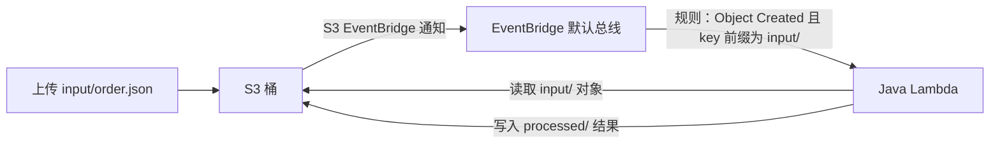

# 架构说明

## 目标

这个实验只演示一条最小的 AWS 事件驱动链路：

## 组件职责

| 组件 | 职责 |
| --- | --- |
| S3 | 保存输入订单和处理结果。开启桶级 EventBridge 通知，不配置 S3 到 Lambda 的直接通知。 |
| EventBridge | 接收 S3 的 Object Created 事件，并只把 `input/` 前缀的对象路由给 Lambda。 |
| Java Lambda | 解析 EventBridge 事件，读取订单 JSON，校验字段，把结果写回同一个 S3 桶，并把运行日志写入默认 CloudWatch Logs 日志组。 |
| Terraform | 声明并部署全部基础设施，保证实验可重复。 |
| LocalStack | 在本机仿真 S3、EventBridge、Lambda、IAM 和 STS。实验复用已经运行的 LocalStack，不启动容器。 |

## 事件路径

1. 客户端把合法订单上传到 `input/order-001.json`。
2. S3 只负责向 EventBridge 发布对象创建事件。
3. EventBridge 规则匹配 `source=aws.s3`、`detail-type=Object Created`、目标桶和 `input/` 前缀。
4. EventBridge 调用 Java Lambda。
5. Lambda 从事件中取出桶名和对象 key，读取输入 JSON。
6. 合法订单写入 `processed/order-001.result.json`；格式错误或校验失败写入 `processed/order-001.error.json`。

## 为什么不会递归触发

EventBridge 规则只匹配 `input/` 前缀，而 Lambda 只写入 `processed/` 前缀。因此 Lambda 产生的结果不会再次命中这条规则。

## 失败语义

- 事件不是 S3 Object Created、桶名不一致、或 key 不在 `input/` 下时，Lambda 拒绝处理。
- JSON 无法解析或订单字段校验失败时，仍写入一个错误结果，方便学习和观察失败路径。
- 事件重复投递时，写入同一个确定性的结果 key；该实验不额外引入幂等表或消息队列。

## Terraform 资源边界

本实验只声明 8 类主要资源：

1. `aws_s3_bucket`
2. `aws_s3_bucket_notification`
3. `aws_iam_role`
4. `aws_iam_role_policy`
5. `aws_lambda_function`
6. `aws_cloudwatch_event_rule`
7. `aws_cloudwatch_event_target`
8. `aws_lambda_permission`

不声明 CloudWatch Logs 资源、SQS、SNS、DynamoDB、Step Functions、API Gateway 或 KMS。Lambda 执行角色仍声明写入默认 CloudWatch Logs 所需的三个权限；真实 AWS 会按约定自动使用 `/aws/lambda/<函数名>` 日志组。

## LocalStack 与真实 AWS 的边界

Terraform 仍然使用 AWS Provider，但所有本实验涉及的 API endpoint 都指向 `http://localhost:4566`，凭据使用 LocalStack 测试凭据。Lambda 运行时位于 LocalStack 的执行环境中，因此 Lambda 内部通过 `host.docker.internal:4566` 访问宿主机上的 LocalStack S3 endpoint。

LocalStack 能验证资源声明、事件路由和端到端数据流；它不能替代真实 AWS 对 IAM 权限细节、服务配额、跨区域行为、真实 Lambda 运行时隔离和生产级可靠性的完整验证。
